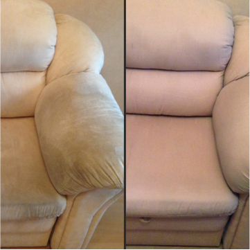

# Clever

Шаблон 1 блока для галлери.
1) Если нужно, что бы фотогрфия не показывалась изначально (а только при клике на кнопку),следут убрать класс active-image.
2) href="image/Examplesof/big1.jpg" - в ковычках путь до большого изображения, которое появляеться при клике.
3) src="image/Examplesof/1.jpg"  - путь до маленького изображения, которое показанно изначально.

               

